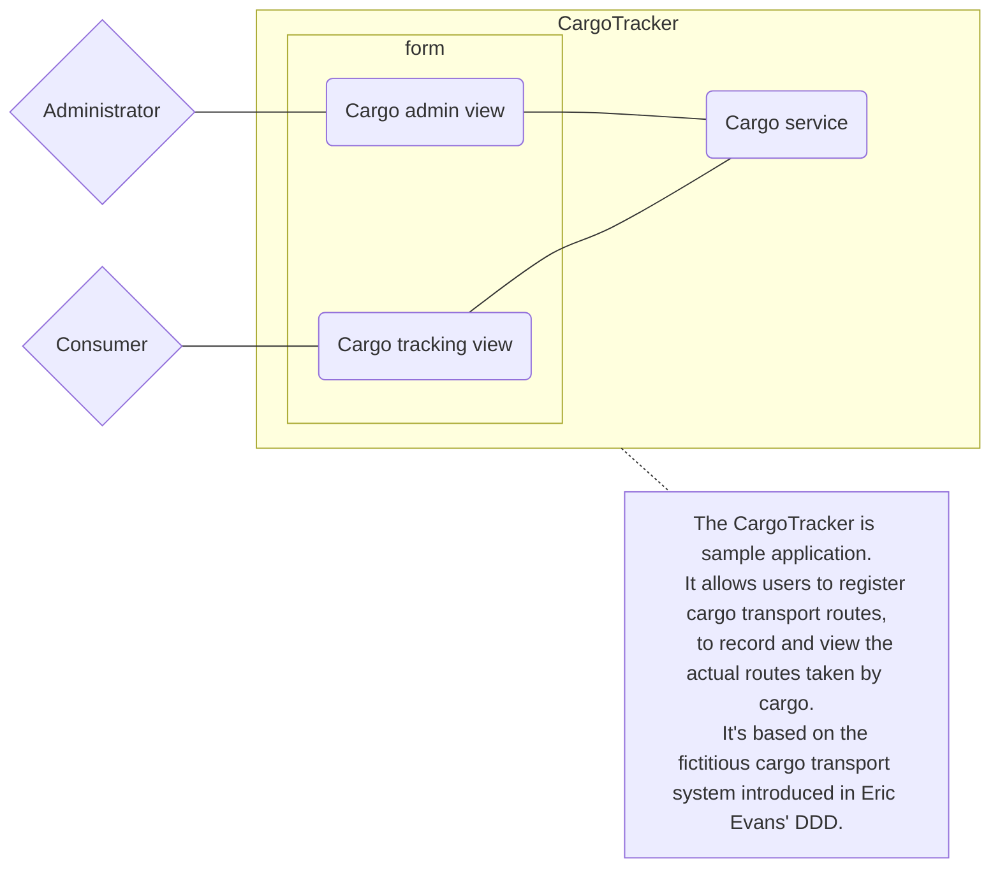
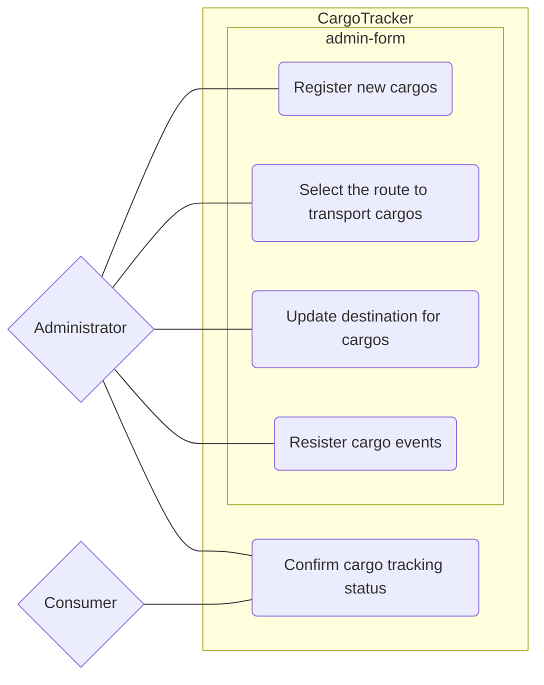

# System chart

## System relationships diagram

The system relationships diagram is used to show the relationship 
between the system to be developed, the actors involved, and external systems.

## Use case diagram

