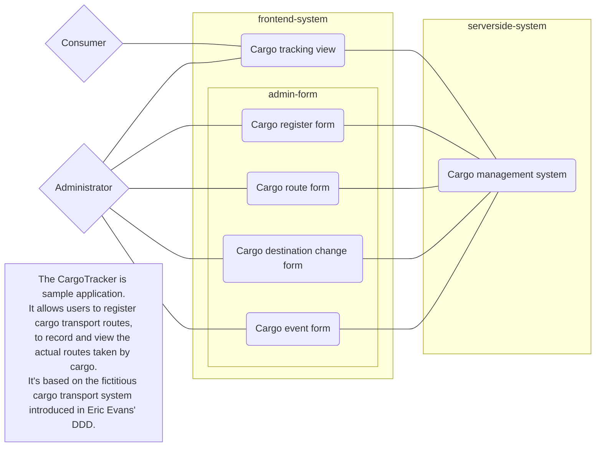

# System chart

## System relationships

```mermaid
flowchart LR
%% Users
%% {}: diamond
AdminActor{Administrator}
UseActor{Consumer}

%% Use cases
%% (): rounded rectangle
TrackingFormU(Cargo tracking view)
ResisterFormU(Cargo register form)
RouteFormU(Cargo route form)
DestinationFormU(Cargo destination change form)
EventFormU(Cargo event form)
CargoSystemU(Cargo management system)

%% Notes
%% []: rectangle
N[The CargoTracker is sample application.
It allows users to register cargo transport routes,
to record and view the actual routes taken by cargo.
It's based on the fictitious cargo transport system introduced in Eric Evans' DDD.
]

%% Groups
subgraph frontend-system
    TrackingFormU
    
    subgraph admin-form
        ResisterFormU
        RouteFormU
        DestinationFormU
        EventFormU    
    end
end

subgraph serverside-system
    CargoSystemU
end


%% Arrows
%% --> arrow, ==> bold arrow, --- line, -.- dotted line, === bold line
UseActor --- TrackingFormU
AdminActor --- TrackingFormU
AdminActor --- ResisterFormU
AdminActor --- RouteFormU
AdminActor --- DestinationFormU
AdminActor --- EventFormU

TrackingFormU --- CargoSystemU
ResisterFormU --- CargoSystemU
RouteFormU --- CargoSystemU
DestinationFormU --- CargoSystemU
EventFormU --- CargoSystemU
```